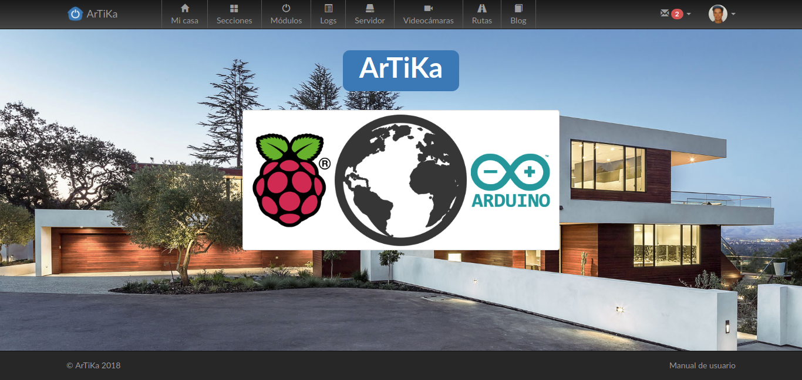
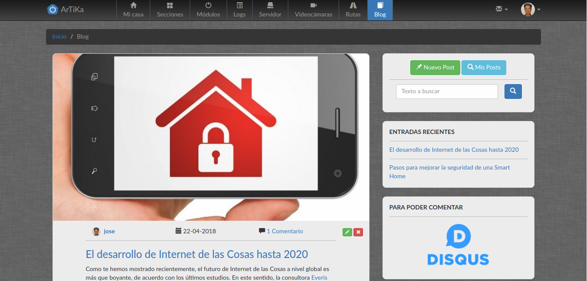

# Manual de usuario

> **Nota:** Aparte de la aplicación web [ArTiKa](https://github.com/arjonatorres/artika), para que funcionen todos los módulos de domótica deberemos tener una Raspberry y un Arduino Uno. Para configurarlos seguir las instrucciones [aquí](https://github.com/arjonatorres/artika-raspberry).

---

### Página de inicio sin loguearse

En la página de inicio antes de loguearnos podemos acceder al blog de seguridad (sólo lectura), tenemos los típicos botones para hacer ***Login*** o ***Registrarse*** en caso de que aún no lo estemos.

También podemos encontrar un video de corta duración explicando qué es la domótica para aquellos que estén empezando en este fascinante mundo.

En el pie de página tenemos un enlace a este manual de usuario que nos ayudará al manejo de la página y a la configuración tanto de la Raspberry como del Arduino.

---

### Página de inicio

En esta página podemos encontrar el logotipo de la web y todas las opciones en la barra de menú superior. Entre ellas se encuentran: ***Mi casa***, ***Secciones***, ***Módulos***, ***Logs***, ***Servidor***, ***Videocámaras***, ***Rutas*** y ***Blog***. En la parte derecha del menú superior encontramos dos opciones: ***mensajes privados*** y ***configuración*** de la cuenta de usuario.

A continuación explicaremos las diferentes opciones disponibles en el menú superior.

---

### Página de Mi casa

Esta es la página principal de la aplicación y es donde se llevarán a cabo las acciones sobre los módulos de domótica. En la zona izquierda encontramos un menú con las diferentes *secciones* de la casa y dentro de cada sección sus correspondientes *habitaciones*. Si hacemos click en el nombre de dicha habitación nos llevará directamente a ella en la parte derecha del página y podremos acceder directamente a sus módulos.

En la parte derecha encontramos el despliegue de todas las habitaciones con sus correspondientes módulos, si estos son del *tipo interruptor* aparecerán dos botones, uno de ***on*** y otro de ***off***, si son de *tipo persiana *aparecerán tres botones, ***subir***, ***bajar*** y ***stop***, si el *tipo es de sensor de temperatura* aparecerá simplemente la temperatura sin que se pueda realizar ninguna acción sobre dicho módulo.

---

### Página de Secciones

En esta página podemos añadir, modificar y borrar las distintas secciones y habitaciones de la casa.

Para añadir una sección simplemente introduce su nombre donde pone ***Nombre de la sección*** y pulsa en ***Añadir***. Dicha sección se añadirá al menú de la parte izquierda y al desplegable de las secciones disponibles al añadir una habitación.

Para añadir una habitación debemos haber creado previamente por lo menos una sección de la casa. Elige un icono para la habitación, introduce el nombre de la habitación donde pone ***Nombre de la habitación***, elige un sección de la casa en el desplegable ***Sección*** y pulsa en añadir.

De este modo podemos configurar nuestra casa con todas las secciones y habitaciones que ésta disponga.

---

### Página de Módulos

En esta página podemos añadir, modificar y borrar los módulos de domótica que vayamos a utilizar.

En la parte izquierda tenemos un menú con todas las habitaciones y los módulos que hay en cada una.

En la parte derecha podemos elegir el icono correspondiente al módulo, indicar el nombre, elegir la habitación a la cual pertenece, seleccionar el tipo de módulo (***Interruptor***, ***Persiana*** o ***Sensor de temperatura***) y configurar los pines del Arduino.

Dependiendo el tipo de módulo la configuración de pines es diferente:
1. Tipo interruptor:
- Solo se habilitarán los *pines digitales* del Arduino, el ***Pin principal*** que será el que actúe de ***On-Off***.
2. Tipo persiana:
- En este caso solo se habilitarán los *pines digitales* del Arduino, el ***Pin principal*** será el pin de subida del motor de la persiana, el ***Pin secundario*** será el pin de bajada del motor de la persiana.
3. Tipo sensor de temperatura:
- En este caso estarán disponibles los *pines analógicos* del Arduino donde conectaremos el módulo de sensor de temperatura.

Por último pulsamos en añadir para agregar el nuevo módulo a la habitación.

---

### Página de Logs

Aquí podemos encontrar los registros(logs) de todas las órdenes que hayamos ejecutado sobre los módulos que disponemos. Se indica el nombre del módulo, la habitación a la que pertenece, la sección en la que está dicha habitación, su nuevo estado, y la fecha y hora de la acción.

Arriba disponemos de un *buscador* por rango de fechas por si queremos hacer una búsqueda más concreta de ciertos días. Eligiremos el día de origen y el día final.

---

### Página de Servidor

En esta página podemos configurar la ***Url*** de nuestro servidor(Raspberry) y el ***puerto*** asociado. Para guardar los cambios pulsamos en el botón ***Guardar***.

En la zona inferior de la página encontramos un dibujo con los diferentes pines del Arduino y de cómo los tenemos configurados, para que a la hora de conectarlos nos sea mucho más fácil identificar para qué es cada pin.

---

### Página de Videocámaras

En esta página en la parte izquierda podemos encontrar las cámaras que tenemos y los botones para ***Añadir***, ***Modificar*** y ***Borrar***.

Para añadir una nueva videocámara indicamos su ***Nombre***, la ***Url*** con la dirección y el ***Puerto*** de dicha dirección. A continuación pulsamos en el botón de ***Añadir***.

---

### Página de Rutas

En esta página podemos visualizar una ruta de seguimiento guardada en un archivo en formato ***.gpx***. Pulse en examinar y seleccione el archivo, a continuación pulse en ***Visualiza ruta***. En la zona inferior aparecerá el mapa con dicha ruta indicando el punto de inicio y de fin. En la zona derecha podemos ver diferentes datos de la ruta, como el *nombre del archivo*, *la hora de inicio*, *la hora de fin*, *la distancia total* y la *duración*.

---

### Página de Blog

Aquí tenemos el blog con los diferentes posts que pueden publicar los usuarios de la aplicación con diferentes temáticas, como pueden ser la seguridad, nuevas tecnologías de control domótico, nuevos módulos...

En la parte izquierda podemos ver los últimos posts por orden cronológico, en la parte derecha encontramos un botón de ***Nuevo Post*** para crear uno nuevo, ***Mis Posts*** para hacer una búsqueda de los posts que hayamos publicado, y un *buscador* de texto que busca tanto en el título como en el contenido de los posts.

Un poco más abajo en la parte derecha encontramos unos enlaces a los últimos posts y un enlace a [Disqus](https://disqus.com/), que deberemos darnos de alta si queremos hacer comentarios a los diferentes posts.

---

### Página de Mensajes

Aquí encontramos los diferentes mensajes privados que nos han mandado los demás usuarios o el administrador. También podemos consultar los mensajes que hemos enviado nosotros.

En la parte superior encontramos enlaces a ***Recibidos***, ***Enviados*** y ***Mensaje Nuevo*** para poder enviar un nuevo mensaje.

---

### Página de Perfil

En esta página podremos configurar todo lo relacionado con la cuenta del usuario. En el menú de la izquierda encontramos los diferentes apartados:
1. **Perfil**
- Aquí configuraremos los datos personales del usuario, y al agregar su dirección se guardará automáticamente la localización de sus coordenadas GPS.
2. **Cuenta**
- Aquí se podrá configurar el nombre de usuario y su dirección de email.
3. **Avatar**
- Aquí se eligirá la foto de perfil del usuario.
4. **Cambiar contraseña**
- Aquí se podrá cambiar la contraseña de acceso a la aplicación. Por seguridad se pedirá la contraseña antigua y por duplicado la nueva.

---
